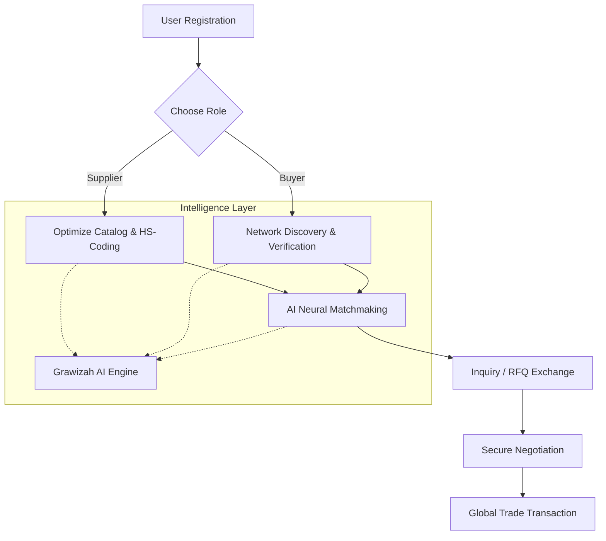
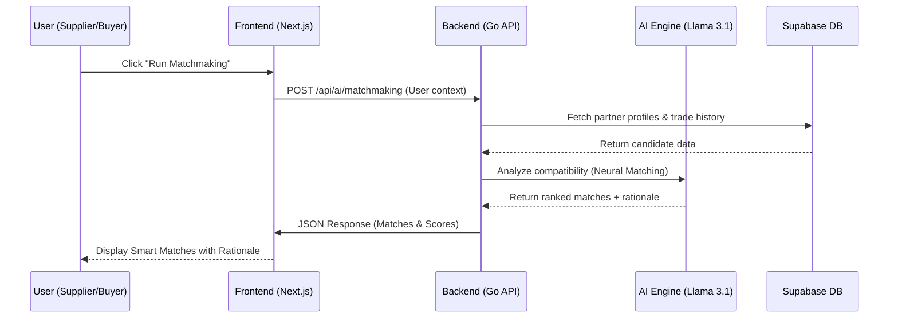
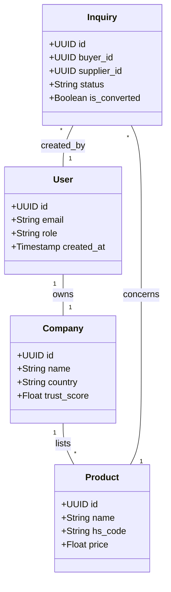

# Grawizah: Next-Gen Global Trade Intelligence Platform
**TechSprint Innovation Cup 2026 – Smart Digital Solution for Real World Problems**

---

## 🏆 Competition Context
Grawizah is a digital innovation developed for the **TechSprint Innovation Cup 2026**. This platform addresses the theme of "Smart Digital Solution for Real World Problems" by revolutionizing how global trade is conducted in the digital era.

### 👥 Our Team: Successful Failures: From Error to Impact
*   **Institution:** President University
*   **Team Leader:** Wisnu Alfian Nur Ashar
*   **Frontend UI/UX:** Reza Fahlevi
*   **Product Manager:** Praisilia Anastasya Pandoh

---

## 🌏 The Real-World Problem: The Indonesian Context
Indonesia's MSMEs (UMKM) contribute over 60% to the GDP, yet only a small fraction successfully penetrate the global export market. Global trade remains a "closed door" for many due to several critical barriers:
1.  **Trust Deficit:** Identifying and verifying reliable international partners is high-risk and expensive.
2.  **Information Asymmetry:** Lack of access to real-time market data and competitor benchmarking.
3.  **Complexity of Compliance:** Navigating HS Codes, international regulations, and documentation is a major bottleneck for small-scale exporters.
4.  **Language & Communication Barriers:** Difficulty in negotiating with partners across different linguistic jurisdictions.

---

## 💡 The Solution: Grawizah
**Grawizah** is an AI-driven Trade Intelligence Platform designed to democratize access to global supply chains. We bridge the gap between Indonesian suppliers and global buyers through a sophisticated, neural-powered interface.

### 🚀 Key Innovations (The "Smart" Factor)
*   **AI Smart Matchmaker:** A neural engine that analyzes production capacity, quality certifications, and historical trade data to connect suppliers with the most compatible global buyers.
*   **Interactive Trade Network Map:** A first-of-its-kind node-based visualization tool that maps global supply chains, allowing users to identify vulnerabilities and alternative routes in real-time.
*   **Neural HS Code Classifier:** Instant, AI-powered classification of products into international trade categories to ensure regulatory compliance.
*   **Automated Buyer/Supplier Radar:** Real-time monitoring of market demand signals, giving users a competitive "radar" to spot opportunities before they vanish.
*   **Multilingual Neural Translator:** Integrated translation service specialized for trade terminology to enable seamless international negotiation.

---

## 📊 Business Intelligence & Strategic Impact
Grawizah isn't just a directory; it is a **Strategic Command Center**.
*   **Data-Driven Decisions:** Every action is backed by predictive analytics and competitor price benchmarking.
*   **Risk Mitigation:** The platform provides a "Trust Score" for every participant, verified by AI through historical documentation and trade patterns.
*   **Supply Chain Optimization:** Identifying bottlenecks through the Network Map allows businesses to reduce logistics costs and lead times significantly.

---

## 🏢 Business Role Differentiation
We recognize that trade is a two-way street. Grawizah provides two specialized portals:
*   **Supplier Intelligence Hub:** Tools for Indonesian manufacturers to optimize their visibility, benchmark prices, and find global buyers.
*   **Buyer Command Center:** Tools for international buyers to discover, verify, and transact with vetted Indonesian suppliers with 100% confidence.

---

## ✅ Readiness for Impact
Grawizah is built on a high-performance **Next.js & Go** stack with **Supabase PostgreSQL** for real-time data persistence. The platform is currently in the **Production-Ready Demo** phase, featuring:
*   Fully functional Role-Based Access Control (RBAC).
*   Live AI Integration for HS Coding and Market Analysis.
*   Responsive "Vercel-inspired" Professional UI with Light/Dark mode support.
*   Integrated Communication System for inquiries and RFQs.

---

## 📐 System Architecture & Technical Flow

### 1. Use Case Diagram
Describes the interaction between users and the core AI-driven features.

```mermaid
useCaseDiagram
    actor "Supplier (MSME)" as S
    actor "Global Buyer" as B
    actor "Grawizah AI Engine" as AI

    package "Grawizah Platform" {
        usecase "Market Intelligence & HS Classification" as UC1
        usecase "Network Visualization (Trade Map)" as UC2
        usecase "Smart Matchmaking" as UC3
        usecase "Inquiry & RFQ Management" as UC4
        usecase "Verification & Trust Scoring" as UC5
    }

    S --> UC1
    S --> UC3
    S --> UC4
    B --> UC2
    B --> UC3
    B --> UC4
    B --> UC5
    UC1 ..> AI : <<include>>
    UC3 ..> AI : <<include>>
    UC5 ..> AI : <<include>>
```

### 2. System Flow Diagram
High-level operational flow from registration to global trade connection.



### 3. Sequence Diagram: Smart Matchmaking
How the platform processes a match request using the AI Neural Engine.



### 4. Class Diagram
Simplified data relationships within the Grawizah ecosystem.



---

## 🛠 Technology Stack
*   **Frontend:** Next.js 14 (App Router), TypeScript, Tailwind CSS.
*   **Backend:** Go (Golang) for high-concurrency trade processing.
*   **Database:** Supabase (PostgreSQL) with Real-time capabilities.
*   **AI Engine:** Integrated Neural Models for Intelligence features.
*   **Design System:** Minimalist Enterprise Aesthetic with Dynamic Background Orbs.

---

## 🌟 Vision
To become the digital infrastructure that powers Indonesia's transition into a global trade powerhouse, ensuring that every Indonesian business—no matter how small—can participate in the global economy with confidence and intelligence.

---

## 👥 Meet the Team: Successful Failures

We are a group of innovators from **President University** dedicated to solving complex real-world problems through high-end digital engineering.

| Name | Role | Institution |
| :--- | :--- | :--- |
| **Wisnu Alfian Nur Ashar** | Team Leader | President University |
| **Reza Fahlevi** | Frontend UI/UX | President University |
| **Praisilia Anastasya Pandoh** | Product Manager | President University |

---
© 2026 **Successful Failures Team** | TechSprint Innovation Cup 2026
