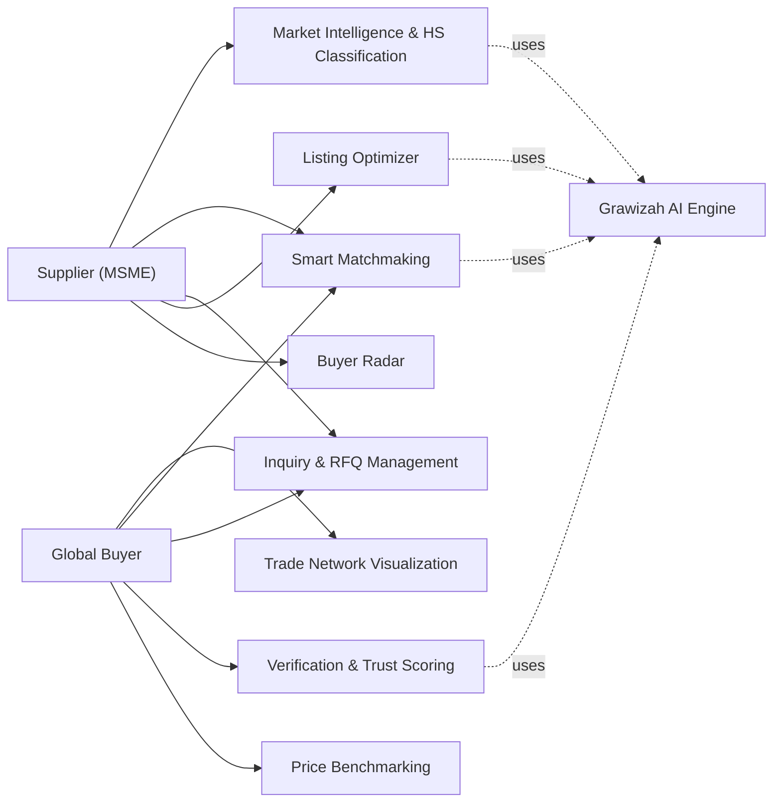
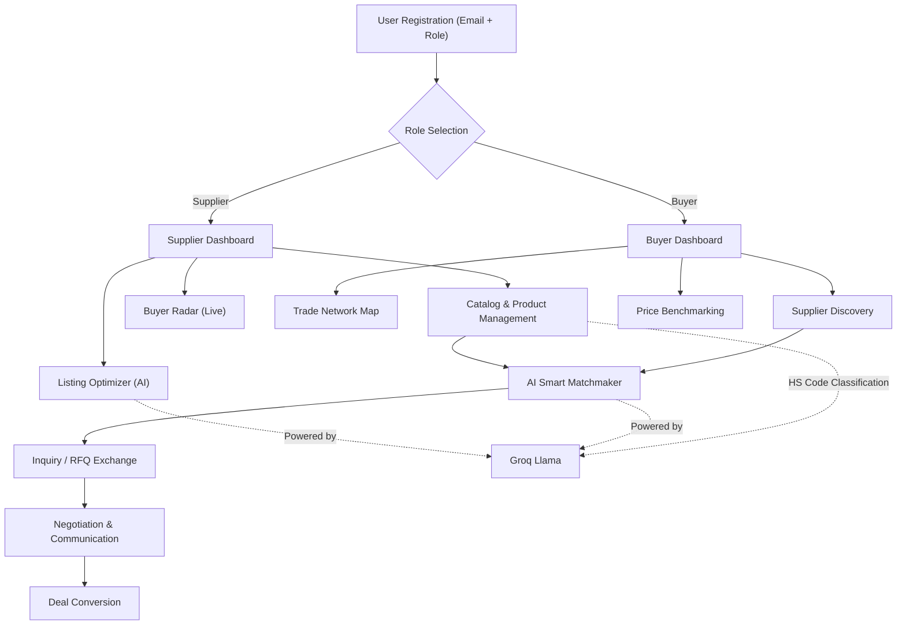
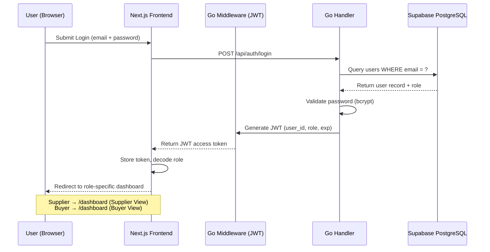
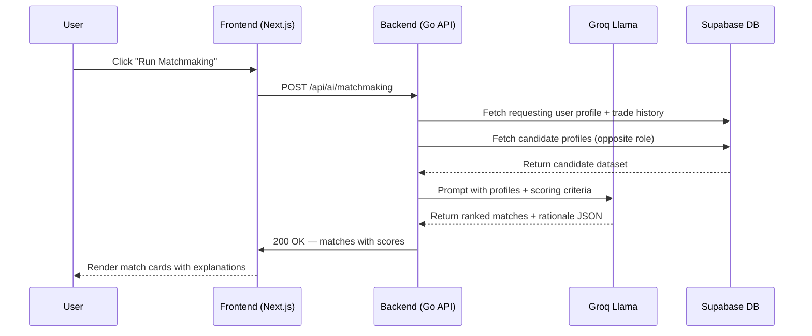
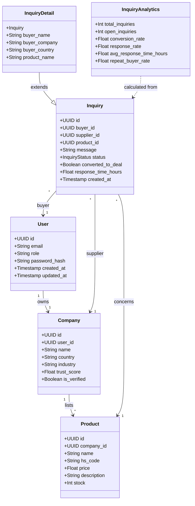

# Grawizah — Global Trade Intelligence Platform

> **TechSprint Innovation Cup 2026** | Category: Web Developer | Theme: *Smart Digital Solution for Real World Problems*

---

## Competition Information

| Field | Detail |
| :--- | :--- |
| **Competition** | TechSprint Innovation Cup 2026 |
| **Organizer** | Codelab |
| **Category** | Web Developer |
| **Theme** | Smart Digital Solution for Real World Problems |
| **Deadline** | May 17, 2026 |

---

## Team: Successful Failures — From Error to Impact

| Name | Role | Institution |
| :--- | :--- | :--- |
| **Wisnu Alfian Nur Ashar** | Team Leader | President University |
| **Reza Fahlevi** | Frontend / UI-UX Engineer | President University |
| **Praisilia Anastasya Pandoh** | Product Manager | President University |

---

## The Problem

Indonesia's Micro, Small, and Medium Enterprises (MSMEs / UMKM) contribute more than 60% of the national GDP, yet fewer than 4% are able to successfully enter the global export market. The root causes are structural and systemic:

1. **Trust Deficit** — Verifying the legitimacy of international trade partners is costly, slow, and unreliable. Fraud in cross-border transactions costs Indonesian MSMEs billions of rupiah each year.
2. **Information Asymmetry** — Small suppliers have no access to real-time global market pricing, competitor benchmarks, or demand signals. Large corporations use expensive private intelligence tools that are out of reach for MSMEs.
3. **Regulatory Complexity** — HS Code classification, customs documentation, and international trade compliance require expertise and resources most MSMEs do not have.
4. **Language and Communication Barriers** — Negotiating with buyers from Germany, UAE, Japan, or South Korea is nearly impossible without specialized translation support for trade-specific terminology.

**Existing solutions** (Alibaba, TradeIndo, Tokopedia B2B) address only listing and discovery. None provide integrated AI-powered intelligence, verification, and communication tooling in a single platform.

---

## The Solution: Grawizah

**Grawizah** is an AI-native Trade Intelligence Platform that transforms how Indonesian MSMEs participate in global commerce. It is not a marketplace — it is a **strategic command center** for international trade.

The platform serves two distinct user roles with purpose-built workflows:

- **Supplier Portal** — Indonesian manufacturers and exporters who need to find buyers, optimize product listings, and expand to new markets.
- **Buyer Portal** — International procurement teams and trading companies that need to discover, verify, and transact with reliable Indonesian suppliers.

---

## Core Features

### 1. AI Smart Matchmaker
A neural matching engine powered by Groq Llama 3.3 that analyzes production capacity, ISO certifications, trade history, and market demand signals to produce ranked buyer-supplier matches with human-readable rationale.

### 2. Interactive Trade Network Map
A real-time, interactive node graph that visualizes global supply chain relationships, route dependencies, and market concentrations. Suppliers can identify at-risk routes and alternative market opportunities.

### 3. Neural HS Code Classifier
AI-powered classification of any product description into the correct international Harmonized System (HS) Code — with confidence scoring — ensuring customs compliance from the start.

### 4. Buyer / Supplier Radar
A live-stream radar feed monitoring global trade demand signals, helping suppliers spot high-intent buyers and helping buyers discover emerging suppliers before competitors do.

### 5. Competitor Price Benchmarking
Real-time price intelligence pulled from multiple global sources, displayed with regional breakdowns and visual bar charts, so both buyers and suppliers negotiate from a position of knowledge.

### 6. Multilingual Trade Translator
An embedded translation engine specialized for trade and procurement terminology, supporting 14 languages including Indonesian, Chinese, Arabic, Japanese, and Korean.

### 7. Inquiry and RFQ Management
A full-featured inquiry pipeline with status tracking (Open → Responded → Closed), conversion tracking, response time analytics, and buyer rating system — all role-aware and real-time.

### 8. AI Listing Optimizer
Automated scoring and improvement recommendations for supplier product listings to maximize visibility and conversion on the platform.

---

## Business Intelligence Layer

Grawizah's differentiator is its **embedded business intelligence**, not just data display:

| Intelligence Feature | Business Value |
| :--- | :--- |
| AI Trust Score (per company) | Reduces due diligence time from weeks to seconds |
| Competitor Benchmark | Eliminates under-pricing and over-pricing risk |
| Smart Match Rationale | Provides context for outreach, improving response rates |
| Response Time Analytics | Identifies operational bottlenecks for suppliers |
| Conversion Rate Tracking | Measures inquiry-to-deal pipeline health |
| Repeat Buyer Rate | Quantifies customer loyalty and relationship depth |

---

## System Architecture

### Architecture Overview

```
┌───────────────────────────────────────────────────────┐
│                  CLIENT LAYER                         │
│   Next.js 14 (App Router) — TypeScript — Tailwind CSS │
│   Role-aware UI: Supplier Portal / Buyer Portal       │
└────────────────────────┬──────────────────────────────┘
                         │ HTTPS / REST API
┌────────────────────────▼──────────────────────────────┐
│                  API GATEWAY LAYER                    │
│   Go (Golang) — High-concurrency REST API             │
│   JWT Auth Middleware — Rate Limiter — CORS           │
└───┬──────────────────────────────────┬────────────────┘
    │                                  │
┌───▼───────────────┐    ┌─────────────▼──────────────┐
│   INTELLIGENCE    │    │       DATA LAYER           │
│   AI ENGINE       │    │   Supabase (PostgreSQL)    │
│   Groq Llama   │    │   Real-time Subscriptions  │
│   HS Code AI      │    │   Row Level Security       │
│   Match Neural    │    │   Full-text Search         │
└───────────────────┘    └────────────────────────────┘
```

### Use Case Diagram



### System Flow Diagram



### Sequence Diagram: Authentication & Role-Based Access



### Sequence Diagram: AI Smart Matchmaking



### Class Diagram



---

## API Reference

| Method | Endpoint | Auth | Description |
| :--- | :--- | :--- | :--- |
| `POST` | `/api/auth/register` | Public | Register new user (supplier/buyer) |
| `POST` | `/api/auth/login` | Public | Login, returns JWT |
| `GET` | `/api/products` | JWT | List products with pagination |
| `POST` | `/api/products` | JWT (Supplier) | Create new product listing |
| `GET` | `/api/inquiries/supplier` | JWT (Supplier) | Get all inquiries for supplier |
| `GET` | `/api/inquiries/buyer` | JWT (Buyer) | Get all inquiries created by buyer |
| `POST` | `/api/inquiries` | JWT (Buyer) | Submit new inquiry/RFQ |
| `POST` | `/api/ai/hs-code` | JWT | Classify product to HS Code |
| `POST` | `/api/ai/matchmaking` | JWT | Run AI match engine |
| `POST` | `/api/ai/translate` | JWT | Translate trade document |
| `POST` | `/api/ai/optimize-listing` | JWT | Get AI listing score & suggestions |
| `GET` | `/api/competitor/benchmark` | JWT | Fetch global price comparison |
| `GET` | `/api/analytics/supplier` | JWT (Supplier) | Get inquiry analytics |

---

## Technology Stack

| Layer | Technology | Justification |
| :--- | :--- | :--- |
| **Frontend** | Next.js 14 (App Router) + TypeScript | SSR, file-based routing, type safety |
| **Styling** | Tailwind CSS | Rapid, consistent design system |
| **Backend** | Go (Golang) | High-concurrency, low-latency API processing |
| **Database** | Supabase (PostgreSQL) | Real-time subscriptions, Row Level Security |
| **AI Engine** | Groq — Llama  70B | Sub-second inference for classification and matching |
| **Authentication** | JWT (bcrypt + RS256) | Stateless, scalable, role-aware |
| **ORM / DB Driver** | `lib/pq` (native PostgreSQL driver) | Direct query control, no N+1 risk |
| **Rate Limiting** | In-process Go middleware | Per-role tier limits (Free / Premium) |

---

## Project Structure

```
grawizah.com/
├── backend/
│   ├── cmd/main.go                    # Application entrypoint
│   └── internal/
│       ├── db/                        # Database connection pool
│       ├── handlers/                  # HTTP request handlers
│       ├── interfaces/                # Repository interfaces (DI)
│       ├── middleware/                # JWT auth, rate limiter, CORS
│       ├── models/                    # Domain models + analytics logic
│       ├── repository/                # Data access layer (SQL)
│       └── services/                  # Business logic layer
├── frontend/
│   └── src/
│       ├── app/
│       │   ├── dashboard/
│       │   │   ├── page.tsx           # Role-aware main dashboard
│       │   │   ├── intelligence/      # Trade intelligence hub
│       │   │   ├── catalog/           # Product catalog management
│       │   │   ├── inquiries/         # Inquiry & RFQ management
│       │   │   ├── leaderboard/       # Supplier leaderboard
│       │   │   ├── products/          # Product management
│       │   │   └── settings/          # Account settings
│       │   └── page.tsx               # Landing page
│       ├── components/
│       │   ├── ui/                    # Reusable UI components
│       │   ├── BuyerRadarTable.tsx    # Live buyer radar
│       │   └── TradeNetworkMap.tsx    # Interactive supply chain map
│       └── hooks/
│           └── useAuth.ts             # Authentication hook
├── database/                          # SQL migrations
├── docs/                              # Additional documentation
├── .gitignore
├── .env.example                       # Safe environment template
├── BACKLOG.md                         # Sprint backlog & task tracker
├── CHANGELOG.md                       # Version history
├── TESTING_CHECKLIST.md              # End-to-end testing guide
└── README.md
```

---

## Local Development Setup

**Prerequisites:** Node.js 18+, Go 1.21+, Supabase account, Groq API key.

```bash
# 1. Clone repository
git clone https://github.com/wi5nuu/grawizah.com.git
cd grawizah.com

# 2. Configure environment
cp .env.example .env.local
# Fill in your Supabase URL, keys, and Groq API key

# 3. Start backend (Go)
cd backend
go run cmd/main.go

# 4. Start frontend (Next.js) — in a new terminal
cd frontend
npm install
npm run dev

# 5. Open http://localhost:3000
```

---

## Deployment

The platform is designed for Vercel (frontend) + any Go-capable host (Railway, Fly.io, GCP Cloud Run) for the backend, with Supabase as the managed database. No additional infrastructure is required.

---

## Vision

To become the digital backbone of Indonesia's global trade ecosystem — giving every MSME access to the same intelligence tools that Fortune 500 companies use, at zero marginal cost.

---

## Team

| Name | Role | Institution |
| :--- | :--- | :--- |
| **Wisnu Alfian Nur Ashar** | Team Leader | President University |
| **Reza Fahlevi** | Frontend / UI-UX Engineer | President University |
| **Praisilia Anastasya Pandoh** | Product Manager | President University |

---

*Grawizah — Built for TechSprint Innovation Cup 2026 by Team "Successful Failures: From Error to Impact" from President University.*
